# About this guide ##
This guide illustrates the process of setting up and configuring the integration between The Wishlist platform and Klaviyo, including the establishment of basic Flows within Klaviyo that can be triggered by metrics from The Wishlist platform. 

Additionally, it covers utilising dynamic data sent from The Wishlist platform to Klaviyo for each event.

## How integrating The Wishlist with Klaviyo improves your marketing ##

Wishlist emails consistently achieve an outstanding open and conversion rate, outperforming other campaign types. 

This heightened engagement can be attributed to the personalised content, ensuring customers receive tailored information about products they're interested in.

## What you need to use Klaviyo with The Wishlist ##

1. Set up Klaviyo as your default email platform within The Wishlist store owner console &ndash; specifying your API keys, and enabling and configuring the types of notifications you want to use. 
2. Create Klaviyo flows that will receive data from The Wishlist whenever a configured event occurs, and send the notification to the customer. 

You can use the full power of Klaviyo, including email and SMS, throttling and extended customer treatments.

## How to create the private key in Klaviyo ##

This is the essential first step for integrating Klaviyo with The Wishlist platform.

You need to create a private API key in Klaviyo. Then add this new Private API key and your existing Klaviyo Public API Key into The Wishlist store owner console in the Klaviyo integration screen. Here's how.

1. In Klaviyo click **Settings > Account > API keys**:


2. Click **Create Private API Key**:


3. Click **Full Access Key**:


4. Enter a **name** for the private API key and click the **Create** button.

5. Copy the private API key (without the first three characters **pk_**) and take note of the public API key

6. Login to The Wishlist

7. Click **Integrations** and click **Activate** under Klaviyo. Now click **Configure**.

Type the public API key into the first field. Paste the private API key you have created into the second field and click **Save**:


Review your notification settings.

You're now ready to set up integrated flows in Klaviyo.

## The Wishlist flows ## 

Each notification type from The Wishlist platform has a corresponding metric in Klaviyo that is automatically created after the above step. These metrics can be used to trigger flows in Klaviyo.  

The following table lists each metric, a short description of why it's triggered, and some examples of the types of flows that are usually setup in Klaviyo to trigger a notification email or SMS to customers.

Each metric will be triggered either by a customer wishlist update, price or inventory update change, or staff action.

| Flow | Metric |Update |
|-----:|---------------|---------------|
|Add to Wishlist|TWC_Add_To_Wishlist|When a customer adds to their Wishlist                    
|Back in Stock|TWC_Back_In_Stock|When a item is back in stock  **a minimum stock level can be set within the Wishlist platform**| 
|Low Stock|TWC_Low_Stock|When an item is low in stock.  **Minimum threshhold levels will be set within the Wishlist platform**| 
|Post Store Visit |TWC_Post_Store_Visit |When a customer or staff member adds an item in-store|
|Price Drop |TWC_Price_ Drop |When an item has a price drop |
|Reminder |TWC_Reminder |Sends a wishlist reminder according to the schedule you set|

## Configuring notifications in The Wishlist Platform ##

To use Klaviyo with The Wishlist, ensure that:

+ The integration is initiated within The Wishlist store owner's console
+ Notifications are enabled and configured


## Setting up Klaviyo flows ##

Now it's time to set up the Klaviyo flows.

1. Click **Flows > Create flow**:


2. Select **Create from scratch**:


3. Name your flow (maybe "Add to Wishlist")

4. Click **Your Metrics** and then **API**:

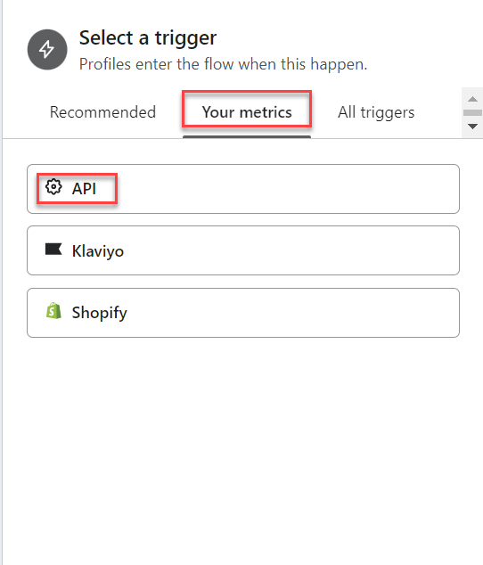

5. Select the **TWC** metric you would like to use to trigger your flow: 

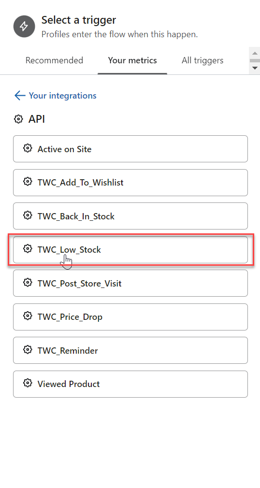

6. Click **Save**. Now it's time to create the email.

### Create email ###

1. Under **Actions**, click and drag **Email** across to underneath the flow:


2. Click **Email** > **Configure content**:


3. Enter the email name, subject line, preview text, sender name, sender email address.

4. Click **Drag and Drop**:


Now it's time to add the email content.

## Add email content ##

To include dynamic product information such as descriptions, prices, and product images in your Wishlist notification emails or SMS templates, you must add merge fields from the table below to each template:

### Wishlist and customer merge fields ###

#### Customer #### 

| Merge field name | Merge field code |
| ----- | --------------- |
|First name| {{ event.Items.0.customer.firstName&#124;default:'' }} |
|Surname|{{ event.Items.0.customer.lastName&#124;default:'' }}
|Email| {{ event.Items.0.customer.email&#124;default:'' }} |

#### Dynamic product attributes ####

| Merge field name | Merge field code |
| ----- | --------------- |
|Product variant image|{{item.product.variant.image_link&#124;default:''}}|
|Product variant URL|{{item.product.variant.link&#124;default:''}}|
|Product title|{{item.product.title&#124;default:''}}|
|Product Variant title|{{item.product.variant.title&#124;default:''}}|
|Product colour | {{item.product.variant.attribute_group.marketing_attributes.attributes.option1.attribute_value&#124;default:''}} |
|Product size|{{item.product.variant.attribute_group.marketing_attributes.attributes.option2.attribute_value&#124;default:''}}|
|Brand vendor|{{item.product.brand&#124;default:''}}|
|Current price|{{item.product.price.sale_price&#124;default:''}}|
|Compare_at price (original price)|{{item.product.price.price&#124;default:''}}|
|Stock level| {{item.product.variant.attribute_group.marketing_attributes.attributes.inventoryQuantity.attribute_value&#124;default:''}} |

### Dynamic content ###

The most effective method for integrating the dynamic product information sent by The Wishlist with each Wishlist-related notification in Klaviyo is by incorporating a Split content block into your email templates.

To incorporate a split content block and integrate the merge code for displaying your products and content, follow these steps:

1. Under **Blocks** “click” **Split** and drag this onto your template where you would like the dynamic products to display:

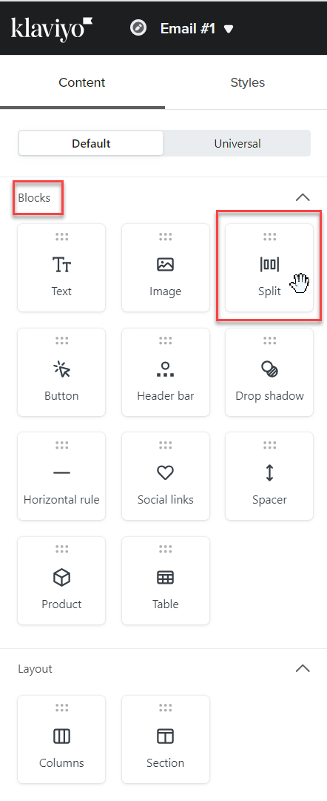

2.	Determine which side of your split content block will contain the product information and which side will feature the product image:

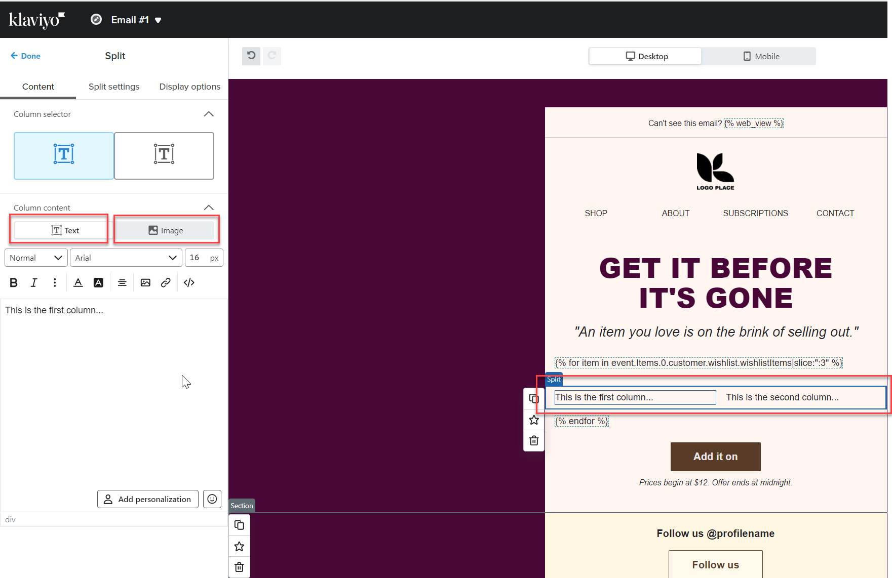

3. Select the left-hand side of the split and click **Image**, and then “click” **Browse Image Library**:

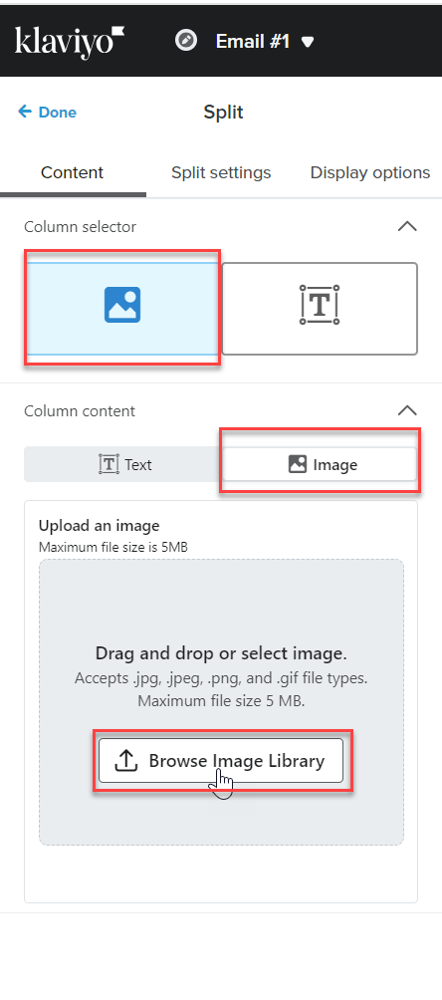

4. "Click" **Dynamic Image** and enter this code ```{{item.product.variant.image_link|default:''}} ``` into the field for the variant image URL:

5. Next, "click" **Save**

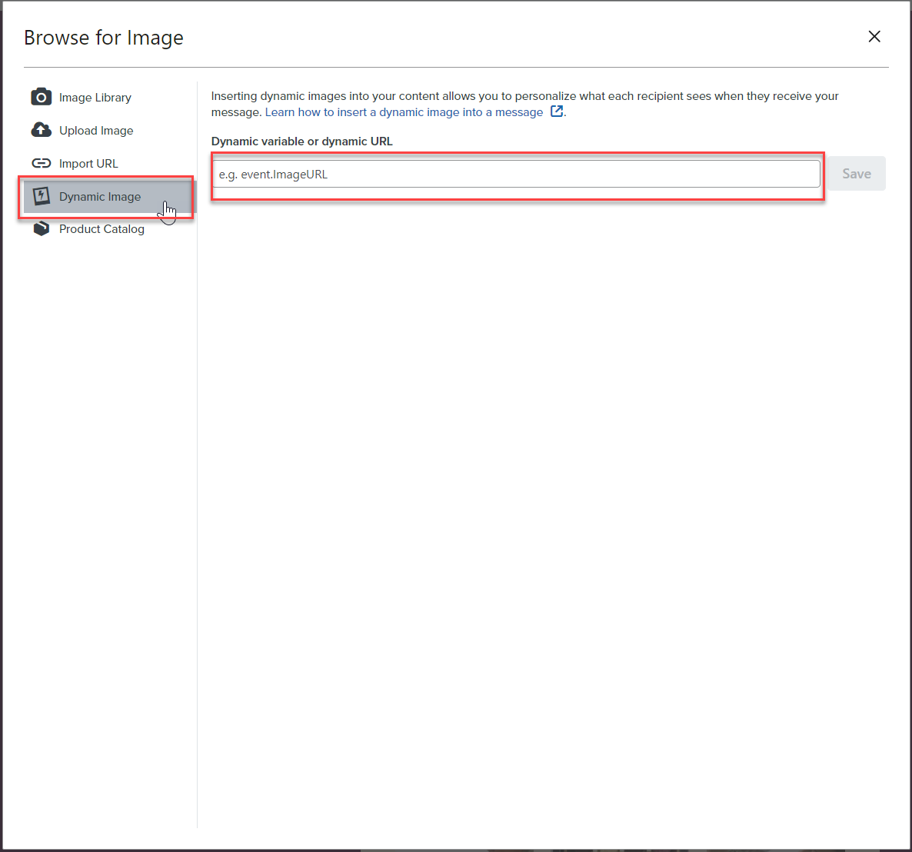

6.	Enter this code ```{{item.product.variant.link|default:''}}``` into the Link address field:

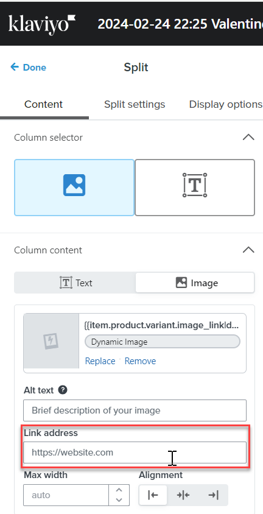

7.	“Click” the box on the right-hand side under **Column selector** and “click” **Text** under Column content:

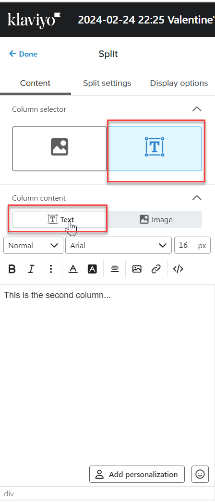

8.	Copy and Paste the relevant merge fields from the table above; in this example, we are going to include the Product name, size and current price:

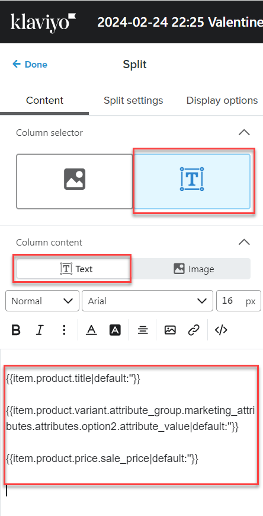

9. Click **Save**

To control the maximum number of products displayed in one of your email templates, you can use the below lines of code. 

The first line needs to be inserted above your dynamic content and image block, and the second line of code needs to be inserted below your dynamic content and image block. 

The numeric value towards the end of the first line of code is the one you adjust to meet your requirements.  

#### Above ####

``````

#### Below ####

``` ```

To insert these lines of code, follow these steps:

1.	Select the Text block under **Blocks** and drag it onto your template, positioning it directly above where you intend to insert your dynamic product copy and image block (split):

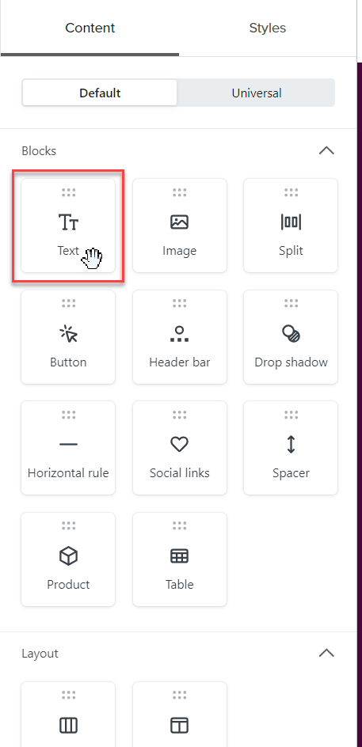

2.	Click the **Source Code** button, then paste the first line of code into the cell. Ensure to press "Enter" after pasting the code. Finally, click the Source code button again to see the code displayed on the template:

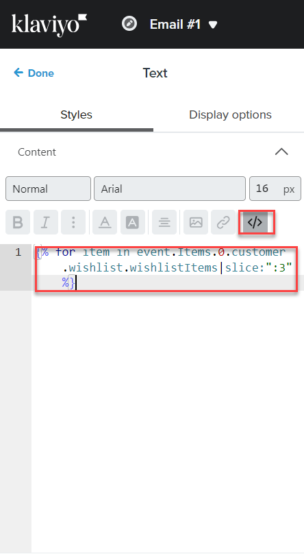

3.	Once you've inserted your content and image block (split), follow the same steps again to add the second line of code directly below it:

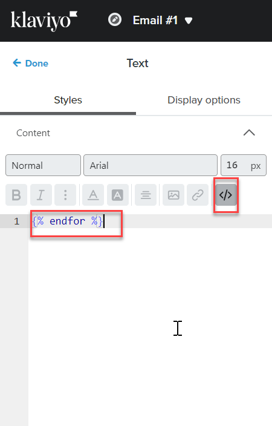


## Preview email ##

Now you're ready to preview your email

Click **Preview and test**

Set the complete flow live and that's it!
