# About this guide
This guide shows you how to set up basic Flows in Klaviyo and how to merge the data coming from The Wishlist.

## How integrating The Wishlist with Klaviyo improves your marketing
The Wishlist Platform integrates with Klaviyo so you can market to The Wishlist customers to drive purchases and increase engagement with your best customers. 

The Wishlist emails typically have a higher than average open rate when compared to other types of campaigns. This is because your customers know they're getting information about products they're interested in.

## What you need to use Klaviyo with The Wishlist

1. Set up Klaviyo as your default email platform within the The Wishlist Store Owner portal &ndash; specifying your API keys and configuring the types of notifications you want to use. 
2. Create Klaviyo flows that will receive data from The Wishlist whenever a configured event occurs, and send the notification to the customer. You can use the full power of Klaviyo, including email throttling and extended customer treatments.

You can use the full power of Klaviyo, including email throttling and extended customer treatments.

> **When using Shopify** you'll need to set up Klaviyo to receive customer updates in real-time from Shopify

## How to create the private key in Klaviyo ##

This is the essential first step for integrating Klaviyo.

You need to create a private API key in Klaviyo. Then add it to the store owner portal in the Klaviyo integration screen. Here's how.

In Klaviyo click **Settings > Account > API keys**:

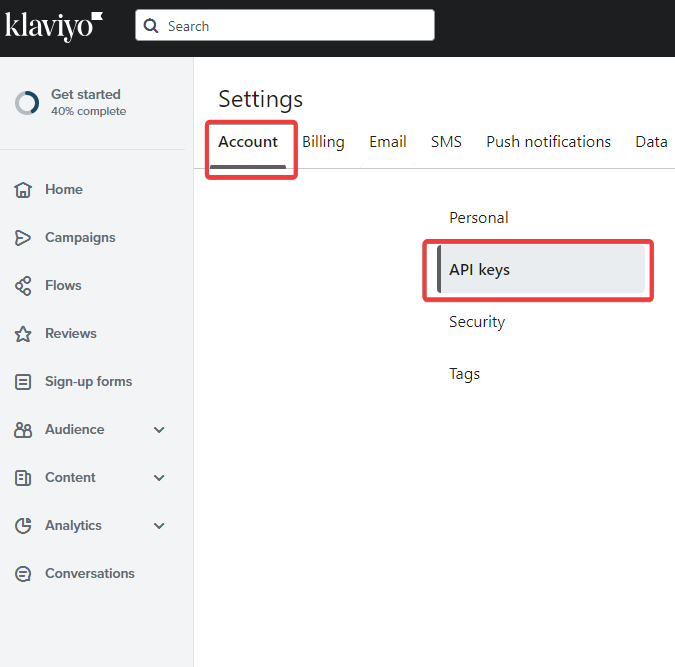

Click **Create Private API Key**:

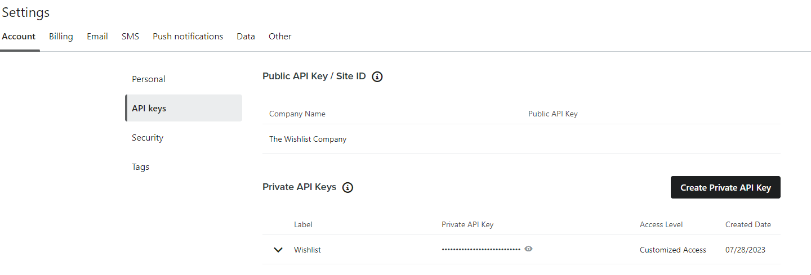

Click **Full Access Key**:

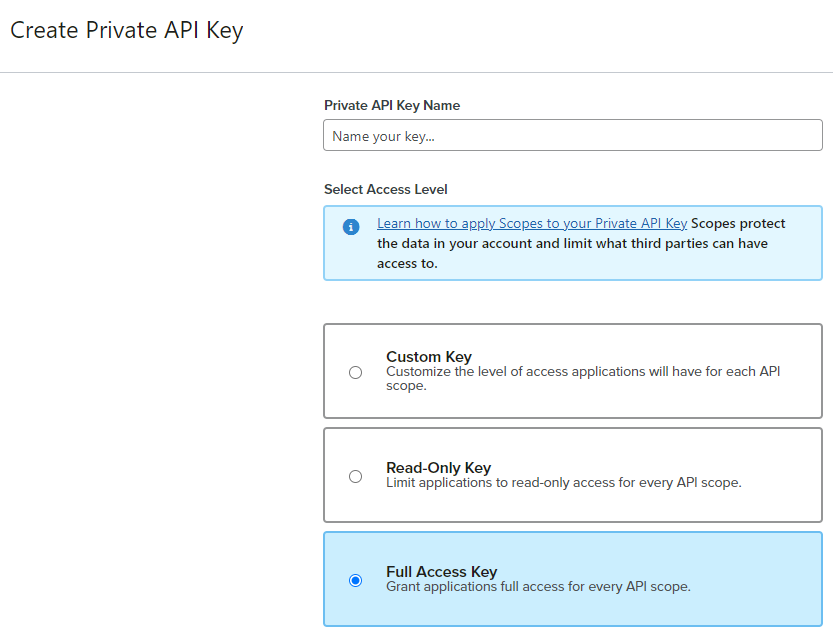

Enter a **name** for the private API key and click the **Create** button.

Copy the private API key (without the first three characters **pk_**)

Login to The Wishlist

Click **Integrations** and click **Activate** under Klaviyo. Now click **Configure**.

Paste the private API key you created and click **Save**:

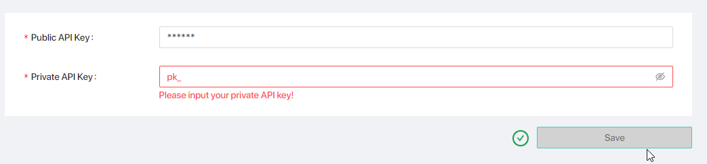

Review your notification settings.

You're now ready to set up integrated flows in Klaviyo.

## The Wishlist flows

The following flows can be set up within Klaviyo. Each flow will be triggered either by a customer wishlist update, price or inventory update or staff action.

| Flow | Metric |Update |
|-----:|---------------|---------------|
|Add to Wishlist|TWC_Add_To_Wishlist|When a customer adds to their Wishlist                    
|Back in Stock|TWC_Back_In_Stock|When a item is back in stock  **a minimum stock level can be set within the Wishlist platform**| 
|Low Stock|TWC_Low_Stock|When an item is low in stock.  **Minimum threshhold levels will be set within the Wishlist platform**| 
|Post Store Visit |TWC_Post_Store_Visit |When a customer or staff member adds an item in-store|
|Price Drop |TWC_Price_ Drop |When an item has a price drop |
|Reminder |TWC_Reminder |Sends a wishlist reminder according to the schedule you set|

## Configuring notifications on the wishlist

To use Klaviyo with The Wishlist, ensure that:

+ The integration is initiated within The Wishlist store owner's portal
+ Notifications are configured

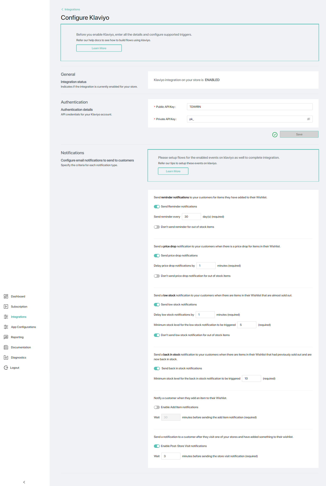

## Setting up Klaviyo flows

Now it's time to set up the Klaviyo flows.

Click **Flows > Create flow**:

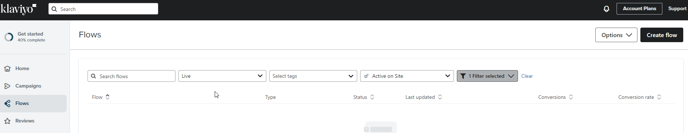

Select **Create from scratch**:

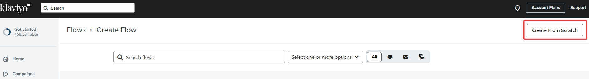

Name your flow (maybe "Add to Wishlist")

Click **Metric**:

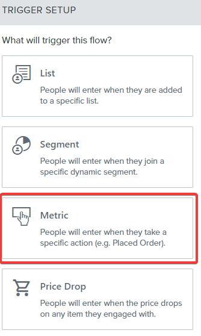

Enter **TWC** in the search box and choose the trigger metric: 

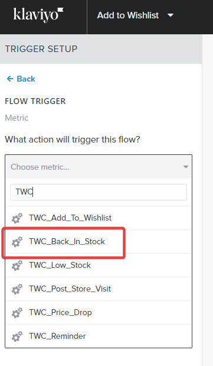

Click **Done**. Now it's time to create the email.

### Create email ###

Under **Actions**, click and drag Email across to underneath the flow:

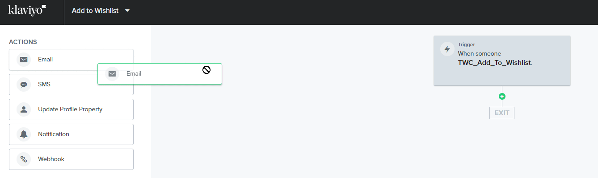

Click **Email** > **Configure content**:

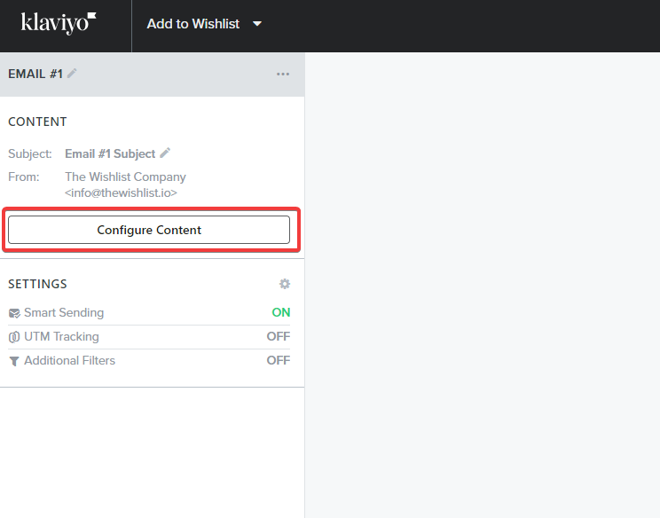

Enter the email name, subject line, preview text, sender name, sender email address.

Click **Drag and Drop**:

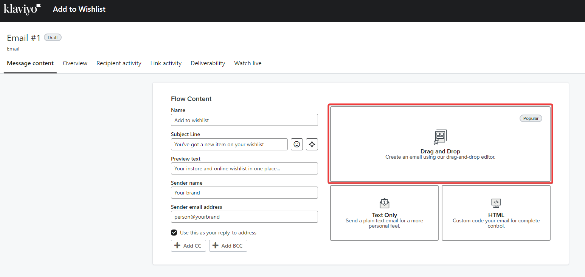

Now it's time to add the email content.

## Add email content ##

You can include merge fields with your content and images. Click the **Source code icon** and select from the merge fields below.

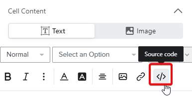

### Merge fields to use ###

| Description | Merge field to include in your content |
|-----|---------------|
|First name|```{{ event.Items.0.customer.firstName&#124;default:" }}```|
|Surname|```{{ event.Items.0.customer.lastName&#124;default:'' }}```|
|Email|```{{ event.Items.0.customer.email&#124;default:'' }}```|
|Product image|```{{ event.Items.0.customer.wishlist.wishlistItems.0.product.variant.image_link&#124;default:'' }}```|
|Product title|```{{ event.Items.0.customer.wishlist.wishlistItems.0.product.title&#124;default:'' }}```|
|Variant title|```{{ event.Items.0.customer.wishlist.wishlistItems.0.product.variant.title&#124;default:''}}```|
|Compare_at price (original price)|```{{ event.Items.0.customer.wishlist.wishlistItems.0.product.price.price&#124;default:'' }}```|
|Current price|```{{ event.Items.0.customer.wishlist.wishlistItems.0.product.price.sale_price&#124;default:'' }}```|
|Stock level|```{{event.Items.0.customer.wishlist.wishlistItems.0.product.variant.attribute_group.marketing_attributes.attributes.inventoryQuantity.attribute_value&#124;default:'' }}```|

Click the **Content** tab.

Select a text or image box in the table.

In a **text box**, insert your **text** and **merge fields**:

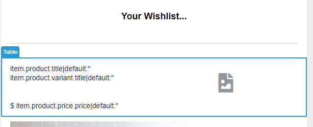

### Dynamic content ###

Add the merge fields you wish to include in the emails. 

To make the content dynamic, you'll need to:

+ Remove **all the code that goes up to and includes the second 0**
+ Replace this code with ```item```

**Example**
To display the current price:

1. Use the price merge field: ```{{ event.Items.0.customer.wishlist.wishlistItems.0.product.price.sale_price|default:'' }}```
2. Remove ```event.Items.0.customer.wishlist.wishlistItems.0``` and replace with ```item```.
3. The merge field is now ```{{ item.product.price.sale_price|default:'' }}```
4. Remove the spaces after the opening ```{{``` and the closing ```}}```
5. The merge field is now ```{{item.product.price.sale_price|default:''}}```

### Dynamic images ###

Click the **image tab**.

In an **image box**, copy and paste the image merge field:

```{{item.product.variant.image_link|default:''}}```

> You'll find the prefix on the merge field changes from ```event.Items.0.customer.wishlist.wishlistItems``` to ```item```

## Using dynamic content tables ##

You can also insert dynamic tables. These can be combined blocks of content, such as product name, image and price.

### How to insert a dynamic table ###

Click the **Table Settings** tab:

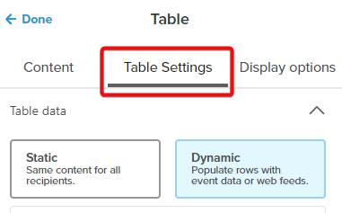

Copy and paste this code into the **Row collection** field:

```event.Items.0.customer.wishlist.wishlistItems```

Copy and paste this text into the **Row alias** field:

```item```

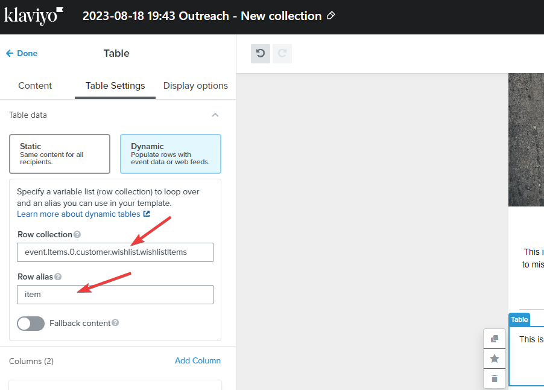

> **Using static tables?** Make sure you manually update the number in the code, to match the rest of the table entries. Everything else stays the same.

## Preview email ##

Now you're ready to preview your email

Click **Preview and test**

Set the complete flow live and that's it!
